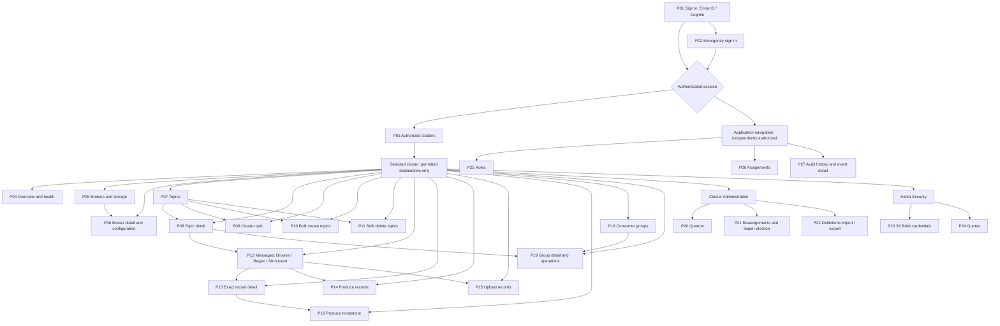

# Kafka3O-UI Design Specification

**Version:** ~~0.7~~ ~~0.8~~ **[NEW]** 0.9
**Date:** ~~2026-09-25~~ **[NEW]** 2026-09-26
**Status:** ~~DRAFT - proposed UX and visual design for user review; not an approved implementation baseline~~ **[NEW]** APPROVED - v1 UX and visual implementation baseline (approved 2026-09-26 under TECH-SPEC section 14; section 14 below)
**Functional baseline:** [FUNC-SPEC.md](FUNC-SPEC.md), revision ~~0.5~~ ~~0.6~~ **[NEW]** 0.7.
**Technical baseline:** [TECH-SPEC.md](TECH-SPEC.md), revision ~~0.12~~ ~~0.16~~ **[NEW]** 0.17, including the approved consolidated contract addendum **[NEW]** revision ~~0.6~~ 0.7.

**[NEW] Current release precedence:** The reduced-v1 scope approved on 2026-09-26 controls all earlier replay, continuation and all-operation statements in this draft. V1 has 26 active page IDs (P17 deferred), 40 command IDs / 46 operations, and 49 permission literals. M1/M3/M4 use one explicit partition and start/end offsets per bounded request. No replay/re-drive, latest/beginning/timestamp scan selector, multi-partition scan or resumable workflow is enabled. Other operations' time/partition controls are unchanged. ~~Scope alignment does not approve the visual/UX draft.~~ **[NEW]** The visual/UX design is approved as the v1 baseline under section 14.

## 1. Purpose and Authority

This document specifies the application experience: information architecture, screens, visual language, interactions, responsive behavior, accessibility, and design acceptance criteria. It does not replace the backend architecture or define new Gateway capabilities.

~~The request for a design specification did not identify visual versus technical design, and the user was unavailable for clarification. This draft interprets it as UX/visual design because the technical specification already has a separate home. All new presentation decisions below are proposals pending review. Existing functional/security requirements remain authoritative.~~ **[NEW]** This document is the UX/visual design; the technical specification has a separate home. The presentation decisions below, including the proposed tokens and components, were approved as the v1 baseline on 2026-09-26. Existing functional/security requirements remain authoritative where they conflict.

No application code, prototype, design assets, or measured accessibility results are delivered by this document. Approval does not resolve the technical specification's blocked design status or pending release verification.

## 2. Audience and Design Principles

| Audience | Primary work | Design consequence |
|---|---|---|
| Kafka operator | Inspect health, topics, messages, groups, and execute authorized changes | Dense readable tables, stable cluster context, inspect-before-execute flows |
| Application administrator | Maintain roles and assignments | Separate application access management from Kafka administration |
| Audit reviewer | Trace actions and outcomes | Filterable history with identity, target, time, outcome, and correlation |
| Emergency operator | Sign in independently of SSO and investigate incidents | Always-present emergency entry, persistent identity indicator, unchanged safeguards |

- Open the usable application, not a marketing page. Signed-out users see authentication; signed-in users without a deep link see authorized clusters.
- Prioritize scanning and comparison. Use full-width work areas, tables, dividers, and restrained status indicators, not floating dashboard cards.
- Keep environment, cluster, and target visible before every operation. Labels are presentation; stable IDs bind requests and state.
- Use action-specific labels such as `Preview deletion`, `Delete topic`, and `Produce records`, not ambiguous `OK` or `Submit` labels.
- Do not infer health, availability, permission, or mutation outcome from missing data. Display the actual distinction.
- Keep operational warnings and validation errors concise and specific. Do not add in-app feature tours, styling explanations, or decorative instructional copy.

## 3. Information Architecture

### 3.1 Global Shell

The desktop shell has a 56px header, a 224px navigation column, and a flexible main area. The header identifies Kafka3O-UI, the selected environment/cluster, and the signed-in identity. The main area starts with breadcrumbs, a compact page title, and contextual actions. Keep cluster context visible when scrolling; sticky elements must not cover focused controls.

Navigation groups:

- **Clusters:** authorized environment/cluster directory, selection, and availability.
- **Selected cluster:** Overview, Brokers, Topics, Messages, Consumer Groups, Cluster Administration, and Kafka Security.
- **Application:** Roles and Assignments, Audit History, and identity/logout controls as permitted.

The cluster switcher groups authorized registrations by environment and matches names locally. It does not edit registrations or accept arbitrary Gateway URLs. Kafka Security means SCRAM and quotas; it is separate from application Roles and Assignments.

Permission-denied navigation is omitted. Within an authorized surface, unavailable capabilities or Gateway safety restrictions may be shown disabled with an accessible reason. Direct URLs still receive backend enforcement. An application administrator with no Kafka permissions can reach application administration without selecting a cluster.

### 3.2 Cluster Context and Navigation

Cluster-scoped pages show environment, friendly cluster name, and an inspectable stable registration ID. Production labels, where configured, are textual as well as visual; do not infer production from an arbitrary name.

Switching clusters discards incompatible plans, selections, result records, and cursors. If there is an unsent draft, offer `Discard and switch` or `Stay`; never offer to carry a destructive draft to another cluster. Late responses from the old cluster cannot update the new view. Switching context does not cancel or roll back an in-flight mutation.

Deep links carry only permitted resource identity and exact offset values. Do not put payloads, credentials, audit reasons, session identifiers, confirmation tokens, or sensitive search text in URLs. Login may return to a validated same-origin resource link; it must never automatically resume a mutation.

### 3.3 Page Navigation Diagram

Page IDs below identify design surfaces, not API endpoints or finalized browser routes. Tabs, review dialogs, and operation forms belong to their owning page and do not create extra permissions. Edges show navigation possibilities, not permission inheritance. Every destination independently enforces section 3.4.

**[NEW]** The v1 diagram excludes P17. Its former cluster-navigation and P13 re-drive links are deferred along with replay; preserve P17's ID in the historical matrix without renumbering retained pages.

Authenticated deep links may open any permitted destination without passing through its list page. Logout and expired sessions return to P01; failed sign-in stays on P01/P02. No-access, denied, loading, unavailable, and outcome-unknown views are states of these pages, not additional resource pages. The application navigation remains available to authorized administrators/auditors even when P03 contains no clusters.

### 3.4 Page Access Rules

`Session` means a valid authenticated application session. `Cluster` means a configured registration authorized for the principal through applicable environment/cluster assignments. In the following matrix, every cluster-scoped row requires both, plus **at least one** of the listed operation permissions; each displayed function requires its own permission. A page grant never authorizes all functions on that page.

Command references such as `T2` are shorthand for the approved literal permissions in TECH-SPEC section 8.2: `T2` maps to `gateway.t2`; sub-operation labels such as `C3.live`, `C9.start`, and `S1.list` map to `gateway.c3.live`, `gateway.c9.start`, and `gateway.s1.list`. Use the complete fixed catalog there, not wildcard or parent-command grants. `Access administration` means `app.access.manage`, `Audit viewing` means `app.audit.view`, and the additional lock-override permission is `gateway.lock.override`. These are permissions, not fixed role names.

- Roles are user-created sets of fixed permissions. Do not hard-code an `operator` or `administrator` role name as a page gate.
- Hide unauthorized tabs/actions and do not fetch their data. A user with only a mutation permission can open its form using an explicit resource identifier without an unrelated list/detail permission. Autocomplete and optional resource context require their corresponding read permission; never obtain them implicitly.
- ~~For snapshot-based M1/M3/M4/M8 workflows that must discover partition bounds, require `gateway.t2` as well as the operation permission before discovery. Explain the missing prerequisite and block that action without hiding an otherwise permitted form. Sufficient explicit inputs retain existing permission requirements; never silently fetch T2. Apply this conditional rule to P12 and P17, not as a blanket page-entry permission.~~ **[NEW]** P12 uses explicit single-partition offset inputs. Optional metadata discovery requires `gateway.t2` before fetching; no implicit T2 grant or blanket page-entry prerequisite. P17 is deferred and has no v1 entry permission.
- If a destination has no allowed function, reject direct access and make zero unauthorized Gateway calls. Loss of permission clears now-protected data and disables further actions on the next authorized state refresh/request.
- ~~Preview, confirmation, execute, download, refresh, and each replay batch independently recheck permissions and scope.~~ **[NEW]** Preview, confirmation, execute, download, and refresh independently recheck permissions and scope. Preview uses its owning operation's permission, not a generic read grant.
- Gateway capability, read-only mode, operation switches, credential tier, and audit availability are additional execution conditions, never substitutes for user permissions. S1/S2 list still use operator-tier Gateway credentials on the server without granting mutation permission.
- The emergency identity passes application permission gates across configured clusters but retains all validation, audit, confirmation, session, and Gateway safety constraints. Override always requires the operation permission plus the separate override permission and an explicit request-scoped reason.

### 3.5 Page Access and Function Matrix

| Page | Scope and entry permission | Functions and per-function access |
|---|---|---|
| P01 Sign in | Public, no authenticated session required | Choose Entra ID or Cognito; show provider-specific errors; open P02. Successful authentication creates a session only after required audit persistence. No cluster data is public. |
| P02 Emergency sign in | Public, always offered independently of SSO | Submit the single emergency identity's password; show throttling/authentication errors; return to P01. Successful login follows the same session and audit gates. No account creation or password-reset page. |
| P03 Authorized clusters | Session | Show only authorized configured registrations grouped by environment; select cluster or application navigation; show no-access state when none qualify. Supplied health/capability observations remain permission-filtered; fresh C3 checks require the corresponding sub-operation. No registry editing. |
| P04 Overview and health | Cluster; any of C1, C3.live, C3.ready, C4, C10 | C1: cluster/controller/broker summary. C3.live and C3.ready: separately authorized health checks. C4: partition health totals and affected resources. C10: topic throughput sample with duration and returned rates. Hide unauthorized panels independently. |
| P05 Brokers and storage | Cluster; C1 or C8 | C1: broker inventory and links to permitted broker detail. C8: broker/log-directory disk usage and optional broker filter. C8-only users can enter broker IDs without loading C1. |
| P06 Broker detail and configuration | Cluster; C2 or C5 | C2: inspect configuration/source/sensitive/read-only markers. C5: set/reset dynamic configuration, review returned plan, confirm broker ID, execute and show result. C5 alone does not fetch C2. |
| P07 Topics | Cluster; T1 | Filter/page topic inventory and toggle internal topics. Link to P08/P09/P10/P11 only with destination permissions; bulk selection is not a T8 grant. |
| P08 Topic detail | Cluster; any of T2, T3, T4, T7, T9, T10, T11, T12, G3 | T2: partition/replica/ISR/offset/configuration details. T3: storage tab. T4: time-window count tab. G3: consumers/lag tab. T7: delete. T9: set/reset configuration. T10: increase partitions. T11: truncate selected offsets. T12: purge. Each mutation has its own preview/confirmation/result; message/group links require their own destination grants. |
| P09 Create topic | Cluster; T5 | Enter name, partitions, replication factor and configuration; validate-only preview; create and display result. No T1 prerequisite; optional topic-list context requires T1. |
| P10 Bulk create topics | Cluster; T6 | Enter multiple definitions, validate all, display all validation errors or per-item creation results. No implicit single-create or bulk-delete permission. |
| P11 Bulk delete topics | Cluster; T8 | Enter explicit topic list or pattern; resolve preview targets, review plan token, confirm and display per-topic results. T1 may supply selection context but is not required for direct input. |
| P12 Messages | Cluster; M1, M3 or M4 | M1: Browse mode. M3: Regex mode and field selector. M4: Structured mode with all supported operators. ~~Each mode owns its bounds, scan statistics, results and supported continuation.~~ **[NEW]** Each mode requires one explicit partition and start/end offsets, displays bounded results and scan information, and has no continuation control. Record detail and write actions need separate permissions. |
| P13 Exact record detail | Cluster; M2 | Resolve cluster/topic/partition/exact-offset link; display record, missing/compacted state, encodings and repeated headers. M2 is required even when entered from M1/M3/M4 results. ~~Authorized M7/M8 actions may use the viewed record as draft input; they require fresh validation/confirmation.~~ **[NEW]** An authorized M7 action may use the record as draft input subject to its own validation; no replay/re-drive action is offered. |
| P14 Produce records | Cluster; M5 | Compose one/multiple records, encoding/partition/timestamp/header inputs, validate and produce, show assigned offsets and item outcomes. Does not grant upload, tombstone or replay. |
| P15 Upload records | Cluster; M6 | Select JSON/NDJSON file, inspect format/size/validation, submit and show per-record outcomes. No M5 prerequisite. |
| P16 Produce tombstone | Cluster; M7 | Enter key, encoding, optional partition and headers; explicitly represent null value; produce and show partition/offset. Reading an existing record is optional and needs M2. |
| P17 Replay / re-drive | ~~Cluster; M8~~ **[NEW]** Deferred beyond v1 | ~~Enter same-cluster source/target and offset/time bounds, optional partition preservation; preview, confirm target, run bounded batch, inspect progress/cursor, stop scheduling and explicitly continue when supported. Re-drive is a one-record range, not a new permission. No message-read grant is implied.~~ **[NEW]** No v1 page, navigation, action, permission or API route. |
| P18 Consumer groups | Cluster; G1 | Page/filter groups by state; show ID/protocol/member count; link to P19 only with a destination permission. |
| P19 Group detail and operations | Cluster; any of G2, G4, G5, G6, G7 | G2: coordinator/members/assignments/offsets/lag. G4: reset/pre-seed offsets. G5: delete inactive group. G6: remove selected/all members. G7: clone offsets to inactive target. Each operation has independent inputs, preview, target/group confirmation and result; read panels do not load without G2. |
| P20 Quorum | Cluster; C6 | Show KRaft leader/epoch/voters/observers/lag; refresh; display unsupported-version errors explicitly. No quorum-edit capability. |
| P21 Reassignments and leader election | Cluster; C7, C9.start, C9.cancel or C9.elect | C7: inspect in-progress reassignments. C9.start: enter new replica assignments. C9.cancel: enter cancellation targets. C9.elect: select preferred/unclean election and targets. Each C9 action separately previews and confirms its returned plan token; C7 is not mandatory for explicit target entry. |
| P22 Definitions import / export | Cluster; C11 or C12 | C11: optional topic-pattern filter and authorized JSON download. C12: upload definitions, choose deletion policy, review create/alter/delete/unchanged sets, confirm plan token and inspect per-target results. Export permission never grants import. |
| P23 SCRAM credentials | Cluster; S1.list, S1.create or S1.delete | S1.list: users/mechanisms. S1.create: credential form with write-only password. S1.delete: username/mechanism target, preview and exact username confirmation. Create/delete-only users enter identifiers without implicit listing; passwords never appear in results/history. |
| P24 Quotas | Cluster; S2.list or S2.alter | S2.list: quota entities and values. S2.alter: explicit entity/values, set/remove preview, entity-descriptor confirmation and results. List is not a prerequisite for explicit entity input. |
| P25 Roles | Session; Access administration | List roles, create/edit named roles using fixed permission choices, save with concurrency checking and audited outcomes. Clearly indicate that this application-wide privilege can grant additional access. No Kafka data access or role-deletion workflow is implied. |
| P26 Assignments | Session; Access administration | View/edit provider-qualified subject/claim-to-role mappings and environment/cluster scopes; show application-wide meaning of administrative grants; save with concurrency checking and audit. **[NEW]** Show enabled/disabled state and permit audited, revision-protected disabling/re-enabling; disabled mappings grant no access. No assignment deletion, identity-provider directory management or Gateway registry editing. |
| P27 Audit history and event detail | Session; Audit viewing | Page/filter authorized application audit history by time/principal/environment/cluster/operation/outcome; inspect event phases, identity, non-secret target, correlation and unresolved attempts. No payload viewer, interactive deletion or unapproved export. |

P25 and P26 are independently navigable tabs in the Roles and Assignments workspace. P20-P22 and P23-P24 are pages beneath navigation groups, not additional permission-bearing landing pages. Account identity and logout are shell controls available to every session, not a separate account-management page.

For each **[NEW]** active page, component/browser tests must cover allowed entry, direct-link denial, absence of unauthorized fetches, partial permission sets, and permission loss. Include a mutation-only principal, a read-only principal, an application administrator without Kafka access, an audit-only principal, and the emergency identity. ~~Verify all 27 page IDs appear in the diagram and matrix, and all 47 command operations have a function-level gate.~~ **[NEW]** Verify all 26 active page IDs appear in the diagram and matrix, P17 is deferred and inaccessible, and all 46 active command operations have a function-level gate. These are design acceptance requirements, not executed application tests.

## 4. Visual System

### 4.1 Color and Typography

Propose a light, neutral operations console with green commands, blue links/information, amber warnings, and red destructive/error states. Dark mode is not part of this draft's initial scope. No gradients, decorative orbs, hero artwork, or large empty dashboard tiles.

| Token | Proposed value | Use |
|---|---|---|
| Canvas | `#F4F5F7` | Application background |
| Surface | `#FFFFFF` | Work surfaces and dialogs |
| Text | `#20242A` | Main text |
| Secondary text | `#525B66` | Labels and metadata |
| Divider | `#D9DEE5` | Non-interactive separators |
| Control border | `#7B8591` | Input boundaries |
| Primary | `#176448` | Main non-destructive action, white label |
| Link / information | `#165DAD` | Navigation links and information |
| Warning | `#805500` | Warning text/icon on `#FFF4D6` |
| Danger | `#B42318` | Destructive actions and error text |
| Focus | `#005FCC` | Visible keyboard focus ring |

Colors are design candidates, not an accessibility certification. Verify every actual foreground/background/state combination, including disabled and focused controls where applicable.

Use self-hosted Source Sans 3 for interface text and IBM Plex Mono for offsets, identifiers, payloads, and code-like values. Confirm licenses and package assets through the existing release review; no third-party runtime font requests. Use `sans-serif` and `monospace` fallbacks that do not prevent operation while fonts load.

Body and control text: 14px with approximately 20px line height; form-entry text: 16px; supporting text: no smaller than 12px; page titles: 24px; section headings: 18px. Use rem equivalents to respect user text scaling. Do not scale font sizes with viewport width; letter spacing is 0.

### 4.2 Spacing, Controls, and Assets

Use a 4px spacing scale, 16-24px page padding, 40px standard table rows, and 40px desktop controls. Compact status labels are not buttons. Increase primary touch targets to at least 44px on narrow/coarse-pointer layouts. Border radius is 4px for controls and at most 8px for dialogs or genuinely framed tools.

Use Lucide icons, or an already-adopted equivalent library, for refresh, copy, search, download, expand, and navigation controls. Select the Blazor integration/package only through dependency approval. Do not introduce custom hand-drawn tool icons. Icon-only buttons have accessible names and hover/focus tooltips. Use icon-plus-text for consequential commands.

Use tabs for views, segmented controls for exclusive modes, checkboxes/toggles for binary settings, menus for action sets, and numeric inputs/steppers for limits. Preserve exact offsets in text inputs with integer validation, not floating-point numeric conversion. Keyboard entry must remain possible for every control.

Visual assets are functional: locally served wordmark/icon assets, status symbols, and data-derived charts where useful. Kafka3O-UI is visible in the shell and sign-in heading. Do not add stock photography to the console. Throughput graphics represent the returned sample only, not an invented historical series, and have an equivalent numeric table.

Reserve icon/label/loading widths so state changes do not resize toolbars. Use at most 120-180ms opacity/position transitions for drawers and context changes; honor reduced-motion settings. No animated counters, moving background decoration, or reorder animations in data tables.

## 5. Screen and Command Coverage

Each row maps one command to its screen family; ~~operations counts preserve the approved 41-command/47-operation inventory~~ **[NEW]** active v1 counts are 40 commands / 46 operations, with M8 retained as a zero-operation deferred row. A shared screen does not merge permissions or omit operation-specific inputs/results. Field schemas and bounds come from the functional and approved API contracts, **[NEW]** including the reduced-v1 overlay, not this presentation table.

| Command | Ops | Screen / interaction |
|---|---|---|
| C1 | 1 | Overview: cluster identity, controller, broker inventory |
| C2 | 1 | Broker detail: configuration table with source, sensitivity, read-only state |
| C3 | 2 | Cluster availability: distinct liveness/readiness and supplied Kafka/audit health |
| C4 | 1 | Overview: partition health totals and affected-resource table |
| C5 | 1 | Broker configuration editor: set/reset diff, preview, broker confirmation |
| C6 | 1 | Cluster Administration / Quorum: leader, voters, observers, replication lag |
| C7 | 1 | Cluster Administration / Reassignments: in-progress targets and replicas |
| C8 | 1 | Brokers / Storage: broker/log-directory usage and partition detail |
| C9 | 3 | Cluster Administration: start/cancel reassignment and leader election, plan review |
| C10 | 1 | Overview / Throughput: topic and sample duration, returned rates and offsets |
| C11 | 1 | Cluster Administration / Definitions: authorized JSON export with pattern filter |
| C12 | 1 | Definitions import: file validation, create/alter/delete/unchanged plan, token confirmation |
| T1 | 1 | Topics: paginated inventory, name pattern, internal-topic toggle |
| T2 | 1 | Topic detail: partitions, replicas, ISR, offsets, approximate counts, configuration |
| T3 | 1 | Topic / Storage: per-partition and replica size table |
| T4 | 1 | Topic / Counts: time-window inputs and approximate offset-derived counts |
| T5 | 1 | Create topic: definition form, validate-only preview, result |
| T6 | 1 | Bulk create: editable definitions, all validation errors, per-item results |
| T7 | 1 | Delete topic: reviewed plan and exact topic confirmation |
| T8 | 1 | Bulk delete: explicit list/pattern, resolved targets, plan-token review |
| T9 | 1 | Topic configuration: before/after diff with set/reset distinction |
| T10 | 1 | Increase partitions: from/to values, irreversible mapping warning, confirmation |
| T11 | 1 | Truncate records: per-partition offset/range review and topic confirmation |
| T12 | 1 | Purge topic: all-partition plan and topic confirmation |
| M1 | 1 | ~~Messages / Browse: topic, partitions, window, bounds, format, records and scan stats~~ **[NEW]** Messages / Browse: topic, one explicit partition, start/end offsets, bounds, format, records and scan stats |
| M2 | 1 | Record detail: authorized exact-offset deep link or missing/compacted state |
| M3 | 1 | Messages / Regex: key/value/header field selection, bounds, matches and skips; **[NEW]** one explicit partition and start/end offsets, no continuation |
| M4 | 1 | Messages / Structured: JSONPath/operator/value inputs, matches and skips; **[NEW]** one explicit partition and start/end offsets, no continuation |
| M5 | 1 | Produce: single/multiple records, encoding/header editor, per-record outcomes |
| M6 | 1 | Upload records: JSON/NDJSON selection, validation, per-record outcomes |
| M7 | 1 | Tombstone: key/encoding/partition/header inputs, explicit null value |
| M8 | ~~1~~ **[NEW]** 0 | ~~Replay: source/target range, partition option, preview, progress and cursor~~ **[NEW]** Deferred beyond v1, including re-drive |
| G1 | 1 | Consumer Groups: paginated list with state filter |
| G2 | 1 | Group detail: members, assignments, committed/end offsets and lag |
| G3 | 1 | Topic / Consumers: consuming groups and partition lag |
| G4 | 1 | Reset/pre-seed offsets: strategy inputs, before/after plan, group confirmation |
| G5 | 1 | Delete group: inactivity requirement, plan and group confirmation |
| G6 | 1 | Remove members: explicit/all selection, plan and group confirmation |
| G7 | 1 | Clone offsets: source/target groups, optional topics, target confirmation |
| S1 | 3 | Kafka Security / SCRAM: separate list, credential creation, and deletion actions |
| S2 | 2 | Kafka Security / Quotas: entity list and set/remove values with plan/confirmation |

### 5.1 Authentication and Application Screens

Sign-in offers Entra ID, Cognito, and a distinct emergency login entry simultaneously. A provider failure affects that provider only. Emergency login uses the single configured identity and a password field with no default value; show a server-supplied retry delay when throttled, never invent an unlock time. Clear password input after submission/failure. Successful emergency sessions have a persistent identity indicator, not an implied bypass indicator.

Roles and Assignments has separate tabs. Role editing selects fixed permissions grouped by feature and action; read, mutate, application administration, audit viewing, and lock override remain distinct. Assignments show provider-qualified subject/claim, role, and environment/cluster scope. Application-wide administrative grants are explicitly labeled and never presented as cluster-isolated. Concurrent-edit conflicts retain the user's non-secret input for review and require reloading current values, not automatic overwrite.

Audit History is a paginated table with time, identity/source, environment/cluster, operation, target, phase, outcome, and correlation ID. Filters match the approved time/principal/environment/cluster/operation/outcome fields. Record detail contains no payloads or credentials. Unmatched attempts are visibly unresolved, not failures or successes. Do not add interactive audit deletion or audit export beyond approved scope.

## 6. Core Interaction Contracts

### 6.1 Tables, Details, and Forms

- Use native semantic tables for comparable records, explicit column headings, pagination, loading, and empty states. Defaults/ceilings follow the Gateway contract (baseline page size 50, maximum 500); do not imply all rows are loaded.
- Add filters or sorting only when supported by the API contract. If sorting the current page locally, label it as page-local; never imply global ordering.
- Row selection is page-scoped unless the operation explicitly resolves a larger target set. Distinguish `Select this page` from a pattern-based bulk operation. Clear selections when scope/filter changes invalidate them.
- Detail navigation retains the cluster and returns to the originating list where safe. Refreshing a read does not silently submit a draft or renew an execution confirmation.
- Render long topic names and identifiers with wrapping or an accessible full-value detail/copy affordance. Never abbreviate a target in its confirmation field. Offsets are exact decimal strings.
- Forms use persistent labels, units, examples only where needed for a field, inline errors, and a linked error summary. Redacted settings are not blank defaults and are not submitted as replacement values.
- JSON/string/base64/null are explicit data modes. A tombstone is not an empty string. Headers are ordered repeatable rows so duplicate keys and binary encodings survive editing.

### 6.2 Destructive Preview and Confirmation

Use a dedicated review surface for bulk/complex plans and an accessible dialog for small single-target plans. Neither is a decorative card nested in another card.

1. Validate inputs and show field errors without claiming execution.
2. Request the authorized preview using the approved Gateway compatibility contract.
3. Show environment, cluster, exact target(s), before/after effects, dry-run result, and operation-specific warnings.
4. Require exact target text for single-target confirmations. For token-based operations, bind the reviewed response token to that unchanged plan; never ask users to invent a token.
5. Enable a clearly labeled destructive command only after review/confirmation requirements are satisfied. Backend validation remains authoritative.
6. While executing, prevent duplicate local submission. Closing a dialog, navigation, or network cancellation must not imply rollback.
7. Display the actual complete, partial, failed, or unknown result. Preserve failures and correlation information until dismissed or navigated away; do not use a disappearing toast as the only record.

Changing inputs or targets invalidates the preview. A stale-plan response requires a fresh review and confirmation, not automatic acceptance. Session expiry or permission loss stops subsequent execution. No action is automatically reissued after login.

### 6.3 Lock Override

Offer an override only when both operation and override permissions are available. Require a non-empty reason and enforce the Gateway's 512-byte/control-character rules, not a 512-character approximation. Show which request receives the override. It never becomes a session-wide switch, and subsequent previews/executions~~/replay batches~~ must not inherit it silently. Read-only mode and disabled operations remain blocking.

### 6.4 Messages, Continuation, and Replay

Browse, Regex, and Structured are distinct modes sharing a bounded scan result layout. Structured search exposes all approved operators: `eq`, `neq`, `contains`, `regex`, `exists`, `gt`, `lt`, `gte`, and `lte`. Keep source/filter/window context visible with scan statistics and partition offsets. Render payloads as inert text, including HTML-looking values.

Display `scanned`, `matched`, `skipped`, bytes, elapsed time, stopped-by reason, and reached-end status. Bound exhaustion is a completed bounded scan with more data potentially available, not an error. ~~Latest-N is not live tailing. Continuation uses exact returned partition offsets, not page numbers.~~ **[NEW]** V1 requires one explicit partition and explicit start/end offsets. Preserve returned cursors as informational statistics only; no next-page/resume control, latest mode, beginning/timestamp selector, or multi-partition scan. Do not label an incomplete scan as a completely searched range.

~~Replay review distinguishes source from target and confirms the target. Progress shows copied count, batch outcome, cursor, and duplicate risk. `Stop` prevents new batches; it does not claim cancellation of writes already in flight. An interrupted/failed batch with reported progress offers explicit user-directed continuation only when its contract is supported. Unknown outcomes never offer a one-click automatic retry that silently duplicates the range.~~ **[NEW]** Replay and its workflow UI are deferred. Retained write operations still display partial/unknown outcomes and never automatically retry an ambiguous write.

~~Multi-partition continuation and route-specific dry-run compatibility are unresolved in TECH-SPEC section 7.6. Wireframes may show the intended states, but implementation must not enable unsupported flows or invent request fields. This is a blocker, not removal of the required feature.~~ **[NEW]** TECH-SPEC section 13 defers B1/B2-dependent features explicitly. Empty or timed-out scans do not prove an empty range; show Gateway stop/incomplete information and the requested bounds without a snapshot guarantee. Separate submissions are independent requests. Retention/compaction may change observations. Backend scope enforcement is mandatory, not just omitted controls.

### 6.5 Bulk and Upload Outcomes

Before execution, show all returned validation errors with item index/target and no-success claims. File selection shows the filename, byte size, format, and validation state. Do not persist uploaded message bodies in browser storage. Respect actual deployment limits, not just source defaults.

After execution, show total/ok/failed counts and each item outcome. HTTP 207 is partial success. Do not retry successful items or imply the operation was atomic. Do not introduce a bulk retry command without a separately defined safe contract.

## 7. State and Feedback Matrix

| State | Presentation | Allowed next step |
|---|---|---|
| Initial loading | Stable table skeleton or progress indicator; accessible busy state | Navigate away; no speculative action |
| Empty result | Contextual empty row/section with active filters visible | Change filter or use an authorized create action |
| No authorized clusters | Access-specific empty state, application navigation retained if permitted | Sign out or use allowed application functions |
| Permission denied | Explicit denial, no cached protected details | Return to authorized navigation |
| Unavailable operation | Distinct compatibility state, not an empty resource | Inspect sanitized reason or change cluster |
| Gateway/Kafka unavailable | Per-cluster status and last observation time | Explicit read refresh; other clusters remain usable |
| Stale observation | Last-observed timestamp and stale label | Read refresh; never claim current health |
| Input rejected | Inline errors plus error summary | Correct input; execution remains blocked |
| Awaiting confirmation | Unchanged plan and target context | Confirm or cancel before execution |
| Executing | Busy indicator and duplicate-submit protection | Navigate with explicit in-flight consequence |
| Succeeded | Actual result with target and correlation | Continue to relevant resource |
| Partially succeeded | Totals and per-item outcomes | Inspect failures; no blanket automatic retry |
| Failed | Classified error, sanitized details, correlation | Correct preconditions; distinguish from unknown outcome |
| Outcome unknown | Persistent warning that writes may have occurred | Inspect resulting state/audit if authorized; no auto-retry |
| Result audit failed | Preserve known business result plus persistent audit warning from `auditStatus: "recording_failed"` and correlation ID | Investigation; no rollback claim or mutation replay |
| Session expired | Sign-in transition; clear protected data and stale plans | Sign in, then reauthorize/review before any new mutation |

Keep upstream credential failures separate from user-session expiry: a Gateway 401 must not log the user out. Distinguish `READ_ONLY_MODE`, `OPERATION_DISABLED`, `DATA_PLANE_LOCKED`, `TIER_FORBIDDEN`, active-group/conflict errors, and unsupported versions. Surface correlation IDs without echoing raw secret-bearing headers or unfiltered diagnostics.

## 8. Responsive Layout and Accessibility

### 8.1 Layout Rules

- At 1200px and above, use the full navigation rail and flexible tables; avoid stretching small forms across the entire viewport (maximum form width 720px).
- From 768px to 1199px, permit a collapsible rail; toolbars wrap into aligned rows and detail inspectors stack when side-by-side content becomes cramped.
- Below 768px, use a labeled navigation drawer and a full-width content column. Keep environment and cluster in the header, wrapping long labels. Forms/review screens stack in reading order; dialogs become viewport-constrained full-width surfaces.
- Do not hide critical operations only because of viewport size. Use a labeled overflow menu where actions cannot fit. Confirmation target/context must remain visible on narrow screens.
- Page content reflows at 320 CSS pixels without document-wide horizontal scrolling. Truly two-dimensional tables/payloads may scroll inside labeled, keyboard-accessible containers; keep essential row identity available.
- At 200% text zoom and 400% browser zoom, controls and text must remain operable without overlap or clipped confirmation labels. Use flexible rows and minimum/maximum dimensions rather than viewport-scaled fonts.

### 8.2 Accessibility Requirements

Target WCAG 2.2 AA, subject to actual testing. Provide landmarks, a skip link, semantic headings, programmatic labels, keyboard navigation, visible focus, and correct dialog focus trapping/restoration. Focus the error summary after rejected submission and preserve logical reading order.

Never use color alone for status, environment risk, selection, or validation. Normal text needs at least 4.5:1 contrast, large text 3:1, and relevant component boundaries/focus indicators 3:1 against adjacent colors. Verify tokens in actual components, not isolated swatches.

Announce meaningful result changes through restrained live regions; do not announce every poll or every appended record. Read-only refreshes should not steal focus. Expose table headers, sorting state where implemented, checkbox selection state, and accessible names for icon tools. Tooltips supplement rather than replace labels or critical warnings.

Confirmation dialogs initially focus a safe heading/control, not an automatically actionable destructive button. Escape closes only when doing so cannot falsely imply cancellation; execution state remains available after closure. Respect reduced motion and forced-colors/high-contrast preferences. Test keyboard-only and screen-reader workflows in addition to automated checks.

## 9. Component and Implementation Alignment

Proposed UI components: ApplicationShell, ClusterSwitcher, ResourceTable, StatusIndicator, ErrorSummary, OperationReview, BulkResultTable, RecordInspector, HeaderEditor, and AuditEventDetail. These names are illustrative, not approved public interfaces or a requirement to abstract every screen.

Place components and feature-state services under Client `Features/`, with the shell in `Layout/` and same-origin API clients in `Http/`, following TECH-SPEC section 5. Reuse only genuinely shared behavior. Do not introduce a global state framework or new UI dependency through this document.

Browser state may hold only the transient data needed for the current interaction. Do not persist credentials, tokens, write-only SCRAM passwords, message bodies, or uploaded files in local/session storage. Clear transient secret fields when no longer needed; never echo them in validation responses. Server authorization and audit controls are not replaceable by component visibility or disabled buttons.

## 10. Design Verification and Traceability

These are proposed acceptance checks for implementation, not tests executed for this draft. Use the approved bUnit and Playwright tooling; additional accessibility tooling requires normal dependency approval.

| Functional criteria | Design evidence required |
|---|---|
| V1 | ~~Every section 5 command screen/sub-operation is reachable when permitted; count remains 41 IDs / 47 operations~~ **[NEW]** Every active command function is reachable when permitted: 40 IDs / 46 operations; 26 active pages, P17 deferred; 49 active permission choices |
| V2, V3, V7 | Both provider entries and emergency login, distinct identities, no-access state, throttle/error states |
| V4, V5 | Permission-filtered navigation/actions, direct-link denial, role conflict, next-request permission loss |
| V6 | Expiry/logout removes protected view state; background polling cannot sustain the session; no mutation replay after login |
| V8 | Independent provider/Gateway failures and separate Gateway/Kafka/audit health |
| V9 | Sentinel-secret checks across rendered content, storage, network responses, diagnostics, and retained traces |
| V10, V11 | Target-visible confirmations, stale-plan invalidation, request-scoped override, distinct safety failures |
| V12, V13 | Exact large offsets, all data modes/operators, scan statistics, inert payload rendering; ~~continuation states~~ **[NEW]** single-partition explicit-offset inputs, unsupported selection rejection, truthful bounded/incomplete/empty states, no continuation |
| V14 | Malformed/oversized upload, validate-all errors, and truthful mixed per-item outcomes |
| V15, V16 | ~~Stop/partial-progress/unknown replay~~ **[NEW]** Replay/re-drive/workflow absence, cluster switch invalidation, rejected late responses, deep-link enforcement; retained mutations still show partial/unknown outcomes |
| V17, V18 | Audit-gated rejection, distinct result-audit failure, unresolved attempts, retention-backed history and restart behavior |
| V20 | Every section 7 state exercised with keyboard and representative narrow/wide layouts |
| V19 | Design fixtures are not proof of live compatibility; real integration results verify implemented behavior separately |

Capture deterministic screenshots at 360x800, 768x1024, 1440x900, and 1920x1080, plus a 320px reflow check. Include long cluster/topic names, large offsets, empty lists, 207 results, unavailable clusters, multi-line errors, review dialogs, and an emergency session. Verify no text/control overlap, hidden focused elements, accidental horizontal page scroll, missing assets, or layout shifts on loading/hover.

Manually review keyboard navigation, focus restoration, screen-reader announcements, zoom, reduced motion, and contrast. bUnit checks component state/interaction; Playwright checks actual browser rendering/navigation. Backend and integration suites still own trusted enforcement and durability assertions.

## 11. Review Gate and Open Decisions

~~Review the interpretation as UX/visual design, light palette/type choices, navigation grouping, screen layouts, and responsive behavior before treating this document as an implementation baseline. No mockup has been approved yet.~~ **[NEW]** The UX/visual interpretation, palette and type choices, navigation grouping, screen layouts, and responsive behavior are approved (section 14). No separate mockup is required; screenshots in section 10 are implementation evidence.

~~TECH-SPEC section 8 records the approved fixed permission IDs, application route baseline, storage fields, explicit session-activity classification, cookie settings, HTTP error statuses, operational limits, and maintenance recovery direction. The UI must use that baseline; explicit navigation/submitted actions notify the activity endpoint, while polling/passive viewing/automatic replay batches do not. Gateway remains unchanged. Empty-confirm previews and backend multi-partition orchestration are still subject to the compatibility investigation, not assumed supported.~~ **[NEW]** TECH-SPEC section 8 records the approved fixed permission IDs, application route baseline, storage fields, explicit session-activity classification, cookie settings, HTTP error statuses, operational limits, and maintenance recovery direction. The UI must use that baseline; explicit navigation/submitted actions notify the activity endpoint, while polling and passive viewing do not. Gateway remains unchanged. Empty-confirm previews are resolved for the 17 active confirmation-bearing operations (TECH-SPEC section 12.1, P6); multi-partition orchestration is deferred.

TECH-SPEC section 9 adds the approved explicit cluster route-mapping rule, separate audit-result failure metadata, session hashing and antiforgery handling, emergency throttle schedule/concurrency, controlled key initialization/rotation, and post-restore access reconciliation. The client keeps the antiforgery request token in memory, sends `X-CSRF-TOKEN` where required, and refreshes antiforgery state after login/logout. It displays the server's throttle response rather than calculating an independent unlock time. Restored sessions are invalidated; the UI cannot silently resume their operations.

TECH-SPEC section 10 defines JSON operation results as `{data, meta: {requestId, auditStatus}}`; the UI checks audit metadata before presenting success and reads equivalent response headers for downloads without changing file contents. Role/assignment updates carry the exact strong revision ETag in `If-Match`; 412 requires conflict review, while 428 indicates a missing precondition. Application-owned lists use one-based `pageNumber`, default `pageSize` 50 and maximum 500, with the approved stable ordering; Gateway-backed lists retain their own contracts. The same section fixes rolling-window throttle admission, exact expiry boundaries, and separate Entra/Cognito callback paths.

~~TECH-SPEC section 11 adds the conditional T2 discovery prerequisite for P12/P17.~~ **[NEW]** TECH-SPEC section 11's conditional T2 discovery prerequisite does not apply in v1 because P12 takes explicit inputs and P17 is deferred. P22 exports enforce a 10,000,000-byte UI limit and check `X-Request-Id` / `X-Kafka3O-Audit-Status` before showing success; no successful truncated download is presented. Error outcomes distinguish `not_started`, `failed`, and `unknown` independently of audit status; failed does not imply rollback. Role/assignment edits distinguish malformed preconditions (400), missing preconditions (428), and stale revisions (412), and use the new revision after success. Audit history reflects hourly retention cleanup of strictly expired events, including unresolved attempts without outcome reclassification; no interactive deletion control is added.

~~Remaining technical blockers are listed in TECH-SPEC section 11.7, including full operation DTO/binding contracts, detailed schemas/security/recovery procedures, bounded export handling, lifecycle details, and Gateway compatibility.~~ ~~**[NEW]** TECH-SPEC section 12 incorporates [CONSOLIDATED-PROPOSAL.md](CONSOLIDATED-PROPOSAL.md), revision 0.2, as the approved P1-P6 contract addendum. P26 reflects the enabled assignment field; replay failures display available typed progress without implying safe automatic retry. Its operation bindings, DTOs, resource/error states, persistence and recovery contracts now govern this draft. Section 12.2 retains B1/B2: latest-mode continuation/completion and aggregate multi-partition semantics/state remain unresolved. Fonts/icons require asset/license verification. The current technical design remains blocked; release verification remains pending. Approval of the contract package does not approve this entire visual-design draft or waive either gate.~~ **[NEW]** TECH-SPEC section 12 incorporates [CONSOLIDATED-PROPOSAL.md](CONSOLIDATED-PROPOSAL.md) as the approved P1-P6 contract addendum; P26 reflects the enabled assignment field. Its operation bindings, DTOs, resource/error states, persistence and recovery contracts govern this design. B1/B2 are deferred with their features. Font and icon sourcing is fixed in section 14; license/notice verification remains a release gate.

## 12. Revision History

| Version | Date | Change |
|---|---|---|
| 0.6 | 2026-09-25 | Aligned with FUNC-SPEC 0.4 / TECH-SPEC 0.11: conditional discovery permission, export cap/audit headers, error and revision feedback, and audit-retention behavior. Visual draft status unchanged. |
| 0.7 | 2026-09-25 | **[NEW]** Aligned with FUNC-SPEC 0.5 / TECH-SPEC 0.12 and the approved consolidated addendum: assignment enable/disable, replay-error progress, and updated B1/B2 blocker references. Visual draft status unchanged. |
| 0.8 | 2026-09-26 | **[NEW]** Aligned with FUNC-SPEC 0.6 / TECH-SPEC 0.16 / addendum 0.6: reduced-v1 message controls, P17 and replay/re-drive links deferred, 26 active pages / 40 commands / 46 operations / 49 permissions, revised acceptance. Visual draft status unchanged. |
| 0.9 | 2026-09-26 | **[NEW]** Approved as the v1 UX/visual baseline (Step 8 remediation F4). Added browser routes, icon/font sourcing and CSP-compatible styling in section 14; struck remaining replay-batch and blocker references. |
| 0.5 | 2026-09-25 | Aligned with TECH-SPEC 0.10: response metadata handling, revision preconditions, application-list pagination, and the latest security/remaining-decision references. Visual draft status unchanged. |
| 0.4 | 2026-09-25 | Aligned with TECH-SPEC 0.9: persistent audit-failure metadata warning, antiforgery transitions, server-driven throttling, invalidated restored sessions, and current remaining-decision references. Visual draft status unchanged. |
| 0.3 | 2026-09-25 | Aligned page-access notation and technical handoff with the approved TECH-SPEC 0.8 contract batch; visual design remains a review draft and compatibility investigations remain open. |
| 0.2 | 2026-09-25 | Added page-navigation diagram, 27-page access/function matrix, sub-operation gate notation, partial-permission behavior, and page-access verification requirements. Remains a review draft. |
| 0.1 | 2026-09-24 | Initial review draft: UX direction, visual tokens, navigation, full command/screen mapping, safe interactions, states, accessibility, responsive behavior, and design verification. No changes to approved functional or technical scope. |

## 13. Current Reduced-V1 Review Gate

**[NEW]** The scope decision approved on 2026-09-26 supersedes section 11's earlier all-operation and B1/B2 handoff statements for v1. Apply FUNC-SPEC section 1.5, TECH-SPEC section 13, and CONSOLIDATED-PROPOSAL section 11. P17, message continuation and latest/multi-partition workflows are deferred, not enabled by the emergency identity or a stale link. No active v1 control offers `gateway.m8` or the four message-workflow APIs.

**[NEW]** All retained operations keep existing authentication, authorization, confirmation, audit, numeric precision, secret isolation, cancellation and release safeguards. Required v1 screenshot/browser checks use bounded single-partition message results, including sparse/incomplete/empty states, and assert absence of replay/continuation controls. Original replay screenshots and workflow-specific checks are deferred with their feature; never report them as passed.

~~**[NEW]** Pipeline Step 8 remains BLOCKED pending full reduced-v1 review and separate approved READY sign-off; release verification remains PENDING. Visual/UX choices in this document remain DRAFT and require their own approval. No application or Gateway code is changed by this alignment.~~ **[NEW]** Visual/UX choices are approved under section 14. Pipeline Step 8 status is recorded by the latest Spec Audit in TECH-SPEC; release verification remains PENDING. No application or Gateway code is changed by this alignment.
## 14. Approved V1 Baseline, Browser Routes, and Assets

**[NEW]** Approved on 2026-09-26 as Step 8 remediation F4 (TECH-SPEC section 14.9). Sections 1-10 and 13 of this document are the v1 UX and visual baseline, as amended by the reduced-v1 overlay. Where this document conflicts with FUNC-SPEC, TECH-SPEC, or the contract addendum, those remain authoritative. Browser routes (F9) were confirmed by the user with the Step 8 sign-off on 2026-09-26.

### 14.1 Browser Routes

**[NEW]** Page IDs map to these Blazor routes. `{clusterId}` is a configuration ID. `{topic}` is a Kafka topic name, whose legal characters (`[A-Za-z0-9._-]`) need no escaping. Other identifiers that may contain reserved characters travel in the query string, percent-encoded once. `{partition}` is a non-negative int32. `{offset}` is an `Int64String`, never parsed through a JavaScript or floating-point number. URLs never contain payloads, search expressions, credentials, audit reasons, session identifiers, or confirmation tokens (section 3.2).

| Page | Route |
|---|---|
| Root | `/` redirects to `/clusters` with a session, otherwise to `/signin` |
| P01 | `/signin` (optional `returnPath` query: a validated same-origin relative path) |
| P02 | `/signin/emergency` |
| P03 | `/clusters` |
| P04 | `/clusters/{clusterId}` |
| P05 | `/clusters/{clusterId}/brokers` |
| P06 | `/clusters/{clusterId}/brokers/{brokerId}` (`brokerId` int32) |
| P07 | `/clusters/{clusterId}/topics` |
| P08 | `/clusters/{clusterId}/topics/{topic}` |
| P09 | `/clusters/{clusterId}/create-topic` |
| P10 | `/clusters/{clusterId}/bulk-create-topics` |
| P11 | `/clusters/{clusterId}/bulk-delete-topics` |
| P12 | `/clusters/{clusterId}/messages` (optional `topic` query) |
| P13 | `/clusters/{clusterId}/topics/{topic}/partitions/{partition}/offsets/{offset}` (M2 deep link) |
| P14 | `/clusters/{clusterId}/produce` (optional `topic` query) |
| P15 | `/clusters/{clusterId}/upload-records` (optional `topic` query) |
| P16 | `/clusters/{clusterId}/tombstone` (optional `topic` query) |
| P17 | Deferred: no route |
| P18 | `/clusters/{clusterId}/consumer-groups` |
| P19 | `/clusters/{clusterId}/consumer-group?groupId={groupId}` |
| P20 | `/clusters/{clusterId}/admin/quorum` |
| P21 | `/clusters/{clusterId}/admin/reassignments` |
| P22 | `/clusters/{clusterId}/admin/definitions` |
| P23 | `/clusters/{clusterId}/kafka-security/scram` |
| P24 | `/clusters/{clusterId}/kafka-security/quotas` |
| P25 | `/access/roles` |
| P26 | `/access/assignments` |
| P27 | `/audit` (list) and `/audit/{eventId}` (event detail) |

**[NEW]** Any other path renders a not-found page inside the shell and makes no API call. A route for an unauthorized or unknown cluster shows the permission-denied or not-found state after the backend decision, never cached protected data. Topic-scoped action routes (P09-P11) use distinct segments so a topic named, for example, `new` cannot collide with an action.

### 14.2 Icons, Fonts, and Styling

- **[NEW]** Icons: vendor the needed Lucide SVG files (ISC license) as static assets under `src/Kafka3O.UI.Client/wwwroot/icons/`, with the license file alongside. No icon package, icon font, or runtime third-party request.
- **[NEW]** Fonts: vendor Source Sans 3 and IBM Plex Mono WOFF2 files (SIL Open Font License 1.1) under `wwwroot/fonts/`, with their license files, loaded through `@font-face` in the self-hosted stylesheet.
- **[NEW]** Styling uses self-hosted CSS classes only, to satisfy the Content-Security-Policy in TECH-SPEC section 14.7: no inline `style` attributes, inline scripts, or inline event handlers. Dynamic visual state uses class changes.
- **[NEW]** License and notice verification of vendored assets remains part of the release gate.
