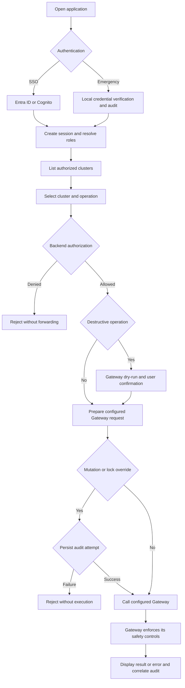

# Functional Specification

**Product:** Kafka3O-UI
**Version:** ~~0.2~~ ~~0.3~~ ~~0.4~~ ~~0.5~~ **[NEW]** 0.6
**Date:** ~~2026-09-22~~ ~~2026-09-24~~ ~~2026-09-25~~ **[NEW]** 2026-09-26
**Status:** **[NEW]** User-approved reduced-v1 functional baseline; pipeline Step 8 review and separate READY sign-off pending
**Pipeline:** Objective and Step 2 behavior mapping completed; Step 3 stack baseline recorded in [TECH-SPEC.md](TECH-SPEC.md). Detailed technical design remains deferred.

**[NEW] Release precedence:** The reduced-v1 scope approved on 2026-09-26 in section 1.5 controls earlier all-operation, replay, snapshot, and continuation requirements throughout this document. The Gateway catalog remains 41 command IDs / 47 operations; v1 implements 40 command IDs / 46 operations. Deferred requirements remain recorded for future review, not enabled v1 capabilities or passed acceptance criteria.

## 1. Objective & Scope

### 1.1 Product Definition

Kafka3O-UI is a centrally deployed Kafka management application containing a web frontend and backend. It lists authorized Kafka clusters across environments and manages them exclusively through their Kafka3O-Gateway instances. Each Gateway connects to one Kafka cluster. The UI backend can reach every configured Gateway; the browser needs access only to the UI application.

The application supports Microsoft Entra ID and Amazon Cognito simultaneously through OIDC, exactly one always-available local emergency account, and server-side role-based authorization. Administrators create roles from a fixed permission catalog and assign them at environment or cluster scope. Gateway API keys and broker credentials are never exposed to browsers; the UI needs no broker credentials or direct Kafka connectivity.

### 1.2 Approved Decisions

| ID | Decision |
|---|---|
| D1 | Frontend and backend are packaged as one application deployment. This does not prescribe a process count or replica topology. |
| D2 | Gateway connections are supplied through configuration and secrets, not created or edited through an administration screen. Each entry identifies its environment and cluster. |
| D3 | Entra ID and Cognito are selectable simultaneously. Claim mappings are configurable; initial claim sources are Entra ID `roles`/`groups` and Cognito `cognito:groups`. |
| D4 | Users may create named roles containing different selections from fixed permissions. Custom permission definitions, scripts, and resource-level policies are excluded. Assignments are environment/cluster-scoped. |
| D5 | Exactly one local emergency account is always available, password-only, unrestricted within the application, and audited. It never bypasses Gateway safeguards automatically. |
| D6 | Session defaults are 4 hours idle and 8 hours absolute. Application role changes apply on the next request; provider membership changes are re-evaluated at login. |
| D7 | Persistence supports configuration selecting SQLite or a supported external database. Database product and implementation choices belong to technical design. |
| D8 | ~~Every specified Gateway command and sub-operation is in scope, including advanced administration and security operations.~~ **[NEW]** V1 retains all catalog operations except M8, with M1/M3/M4 restricted by section 1.5. Advanced administration and security operations remain in scope. |
| D9 | Non-integration tests use fake dependencies. Only explicitly designated integration tests contact real Gateways. |
| D10 | Audit retention is configurable, default 90 days. Mutations fail closed when their audit attempt cannot be persisted. |

### 1.3 Measurable Objectives

| ID | Objective | Acceptance measure |
|---|---|---|
| O1 | ~~Complete Gateway feature coverage~~ **[NEW]** Complete reduced-v1 coverage | **[NEW]** All 40 active command IDs / 46 operations in section 2.5 map to a UI function and contract test, including enforced M1/M3/M4 restrictions and absence of M8. |
| O2 | Central multi-environment management | Integration tests operate through two configured Gateways; one unavailable Gateway does not prevent operations against the other. |
| O3 | Authentication and authorization enforcement | Both OIDC providers and the emergency account are tested; denied requests forward zero calls to the target Gateway operation. |
| O4 | Secret isolation | Browser responses, storage, errors, and logs expose no Gateway keys, OIDC secrets/tokens, local password material, or SCRAM passwords. |
| O5 | Preserve Gateway safety and data semantics | Tests cover confirmations, dry-runs, stale plans, bounds, lock overrides, partial outcomes, and replay continuation. |
| O6 | Human accountability | Audited actions identify the user and correlate with Gateway requests; audit-attempt failure prevents mutation. |
| O7 | Persistence portability | The same functional persistence tests pass with SQLite and each external database supported by the technical specification. |

### 1.4 Boundaries and Source Baseline

Gateway contracts are the source of truth for Kafka operations: Kafka3O-Gateway `spec/FUNC-SPEC.md` revision 0.4, sections 5, 8, and 9, and `spec/TECH-SPEC.md` revision 0.7, section 6.2. This specification adds UI behavior and user-level controls; it does not change the Gateway API.

~~**Source discrepancy:** The Gateway documents claim 41 commands and 48 REST operations. Their explicit URL table enumerates 41 commands and **47 command operations**: C3 has two, C9 three, S1 three, S2 two, and every other command one. `/openapi.json` and `/docs` are two additional documentation routes, not command operations. Coverage is defined by the enumerated operations, not an invented 48th operation. Reconcile the Gateway's count before freezing an operation-count release gate; no Gateway files are changed by this specification.~~

**[NEW]** Approved compatibility baseline: 41 command IDs and 47 command operations, confirmed by the checked-in Gateway OpenAPI snapshot and source assertions inspected on 2026-09-24. C3 has two, C9 three, S1 three, S2 two, and every other command one. Adopt `/v1/health/live` and `/v1/health/ready` for C3; `/openapi.json` and `/docs` remain additional documentation routes. The upstream 48-operation claim and unprefixed health paths are documentation discrepancies, not extra required UI operations. These narrow decisions are detailed in TECH-SPEC section 7.6; other upstream contracts are not silently overridden and no Gateway files are changed.

~~The Gateway implementation is in progress. Specified support is not evidence that a deployed version implements an operation. The UI distinguishes unavailable operations and incompatible deployments from permission denials and resource-not-found errors.~~ **[NEW]** Inspected Gateway source and its checked-in OpenAPI snapshot cover all 41 command IDs; tests contain an empty-pending-list assertion. This is not evidence that a particular deployed version implements the same contract, and those tests were not executed during this review. The UI distinguishes unavailable operations and incompatible deployments from permission denials and resource-not-found errors.

Out of scope: direct Kafka access; cross-cluster message copying; Schema Registry and Avro/Protobuf decoding; Kafka Connect, ksqlDB, MirrorMaker, Kafka ACL management; additional local accounts; arbitrary custom authorization policies; topic/group-scoped permissions; message transformation; durable background replay jobs; historical Kafka metrics storage; live WebSocket/SSE tailing; runtime editing of Gateway startup safety switches. Exporting definitions from one cluster and explicitly importing them into another remains supported by C11/C12, with authorization on each cluster.

### 1.5 Approved Reduced-V1 Scope

**[NEW]** Approved on 2026-09-26. V1 is a Kafka administration UI with bounded message inspection. Keep both SSO providers, emergency access, roles/assignments, sessions, audit, both databases, maintenance/recovery, and single-replica Kubernetes deployment. Keep every cluster, topic, consumer-group, SCRAM, and quota operation, plus M2 exact lookup and M5-M7 produce/upload/tombstone.

**[NEW]** M1/M3/M4 require one explicitly selected partition and explicit start/end offsets. Each user submission performs one bounded message scan, preserving the Gateway record order, encodings, statistics, stop reason, and cursor values as informational output. There is no continuation control, automatic next request, merged result set, or cross-request snapshot guarantee. Separate submissions are independent. Required scan and response limits still apply.

**[NEW]** Defer M8 entirely, including preview, execution, and single-record re-drive; latest-N/preceding-window browsing; multi-partition message scans; beginning/timestamp selection for M1/M3/M4; resumable browsing/search; and the four message-workflow endpoints with their tokens, revisions, retained results, and memory manager. This does not defer timestamp or multi-partition inputs for other retained operations such as T4, T11, or G4.

**[NEW]** Enforce these exclusions on the backend, including for the emergency identity. No replay/workflow endpoints or M8 permission are offered in v1. Reject unsupported message selection instead of silently substituting one partition or changing the requested mode. The active catalog has 46 Gateway permissions plus the three existing application/override permissions, 49 literals total. Topic metadata remains separately authorized; explicit scan inputs do not grant T2 implicitly.

**[NEW]** Scans are bounded observations, not exhaustive search or immutable snapshots. Retention/compaction may affect results. Empty results or timeout alone never prove an empty range or complete scan; preserve incomplete state and Gateway stop information. Cancellation does not establish non-execution or rollback. Existing authentication, audit, confirmation, override, precision, secret-isolation, dependency-isolation, and all-severity zero-CVE requirements remain mandatory for retained functionality.

**[NEW]** B1/B2 and the associated adapter proof move to deferred-feature work, not fixed incompatibilities. Reintroduction needs explicit scope approval, complete contracts, and compatibility proof. Reduced-v1 approval does not grant pipeline Step 8 READY, approve the visual draft, authorize task creation, or waive release verification. Technical details and acceptance overlays are in TECH-SPEC section 13 and CONSOLIDATED-PROPOSAL section 11.

## 2. Inputs, Outputs & Interfaces

### 2.1 External Dependencies and Trust Boundaries

| Dependency | Interface and purpose | Verification |
|---|---|---|
| Configured Gateways | Backend HTTP requests over HTTPS; one endpoint per cluster; `/v1` command routes, health routes, authenticated OpenAPI retrieval | Recording HTTP fakes outside integration tests; real Gateways only in integration tests |
| Microsoft Entra ID | OIDC discovery, authorization, token exchange, signature keys, configured role/group claims | Mock OIDC issuer for normal tests; opt-in provider integration tests |
| Amazon Cognito | OIDC discovery, authorization, token exchange, signature keys, configured group claims | Mock OIDC issuer for normal tests; opt-in provider integration tests |
| SQLite or external database | Roles, mappings/assignments, sessions, application audit records | Repository-level fakes and SQLite tests; explicitly designated external-database integration tests |
| Deployment configuration and secrets | Gateway registry, TLS trust, OIDC settings, local account hash, database settings | Synthetic configuration and secret fixtures, never production secrets |

The backend authenticates users independently of Gateway keys. It chooses the appropriate configured Gateway credential after authorization. Reader-tier credentials are used where the Gateway supports them; operator-tier credentials are needed for all W commands and approved lock overrides, including overridden reads. S1 and S2 require operator-tier Gateway credentials even for their list sub-operations under the current Gateway catalog; this does not grant users their mutation permissions.

Gateway credentials and OIDC tokens remain server-side. The backend accepts only configured Gateway identifiers, not caller-supplied destination URLs or authorization headers. TLS validation is required; arbitrary upstream redirects must not allow credential forwarding outside the configured destination. Resource names are encoded as path parameters, not interpreted as URLs.

### 2.2 Configuration and Application Data Contracts

These are logical contracts, not a selection of storage schema, programming framework, or public route names.

| Object | Required logical fields and behavior |
|---|---|
| Gateway registration | `id`, `displayName`, `environmentId`, `baseUrl`, `readerKeySecretRef`, `operatorKeySecretRef`, TLS trust settings. IDs are stable and unique; environment and display labels are not security identities. Secret values never appear in public representations. |
| Environment | Stable `id`, display label; groups configured Gateways and defines assignment scope. |
| OIDC provider | Stable provider ID, provider type, trusted issuer, client ID, client-secret reference where required, registered callback, and configured claim mappings. Entra and Cognito coexist without merging identities by email. |
| Principal | Authentication source, issuer plus subject for SSO, or a separate local-account identity; display name and email are presentation fields only. |
| Role | Stable ID, name, selected fixed permission IDs. Roles have no executable policy or newly invented permission types. |
| Assignment/mapping | Provider-qualified subject or exact configured claim value, role ID, scope type (`environment` or `cluster`), scope ID. Application-management permissions retain application-wide meaning as described in section 2.3. |
| Session | Opaque session identity, principal, login time, last qualifying activity, absolute expiry, provider claim snapshot, revocation state. No session identifiers in URLs. |
| Cluster-list item | Configured ID, name, environment, observed Kafka cluster ID when available, separately identified Gateway/cluster health, supported-operation state, and effective permissions. Never credentials. |
| Operation request | Selected cluster ID, fixed operation ID, validated command inputs, correlation ID; confirmation, dry-run, and explicit lock-override reason when applicable. Arbitrary proxy requests are not accepted. |
| Operation response | Gateway result or classified error with correlation ID; preserve per-item results, scan statistics, continuation, and progress. Do not replace partial success with a generic success message. |
| Audit event | Event ID, UTC time, correlation ID, principal/authentication source, environment/cluster when applicable, operation, non-secret target metadata, phase, outcome, dry-run flag, override reason when supplied, and error code. |

Database selection is deployment configuration. Both storage modes must preserve equivalent authorization, expiry, audit, and restart behavior. Gateway registry data and credential references remain configuration-managed; role and mapping changes are application-managed and persisted. Unrestricted local access provides the bootstrap path for initial role administration.

### 2.3 Fixed Permission Catalog and Role Semantics

Kafka permissions correspond to the fixed Gateway command operations in section 2.5. C3, C9, S1, and S2 expose their listed sub-operations separately so that, for example, SCRAM listing does not imply credential creation or deletion. GET versus POST alone must never decide whether an operation is a mutation: M3/M4 are read-only POST searches.

Additional fixed application permissions cover role/assignment administration, audit viewing, and data-plane lock override. Application-management permissions do not grant Kafka data or mutation permissions. Role/assignment administration is an explicitly privileged capability capable of granting other roles; it must be labeled and audited accordingly, not treated as ordinary cluster administration.

- A user's effective Kafka permissions are the union of matching assignments for the selected cluster and its environment. An unmatched operation is denied by default.
- Assignment scope controls Kafka access; application-wide administration permissions are separately identified in the catalog, not advertised as cluster-isolated administrative authority.
- No matching role grants no Kafka access. An application administrator can administer roles without being granted Kafka message-read permissions.
- The backend filters the cluster list and rejects direct navigation/API access to unauthorized clusters. UI visibility alone is not a security control.
- Permissions are re-evaluated on each request, including dry-runs, downloads, bulk operations, and each replay batch. A change affects subsequent requests, not an already executed mutation.
- In-session provider claims are the verified login snapshot. Local role/mapping changes apply on the next request; provider membership changes apply at the next login, bounded by the 8-hour session lifetime.
- Lock override requires the normal operation permission plus the separate override permission. No role may override Gateway read-only mode, per-operation switches, or credential tier restrictions.
- The sole emergency identity has all application permissions on all configured clusters. Upstream availability, Gateway credentials, validation, audit, and Gateway safety still apply.

**[NEW]** Approved on 2026-09-25: snapshot-based browsing/search/replay additionally requires `gateway.t2` when the UI backend must discover partition bounds through topic details. Require both permissions for the same configured cluster before discovery; never grant T2 implicitly. Operations with sufficient explicit inputs retain their existing permissions. An authorized operation form may remain accessible while a discovery-dependent action is blocked with a clear missing-permission explanation. This conditional prerequisite does not establish correctness of multi-partition continuation; TECH-SPEC section 11.1 retains that investigation gate.

### 2.4 Shared Gateway Contracts

| Surface | UI/backend requirement |
|---|---|
| Authentication | Backend supplies `X-Api-Key`; health and OpenAPI routes also require it when Gateway authentication is enabled. Upstream 401 is a Gateway credential/configuration failure, not an instruction to log the user out of SSO. |
| Correlation | Propagate a valid `X-Request-Id` and retain the returned value in results and audit. Follow Gateway character/length limits. |
| JSON and uploads | Normal requests use `application/json`; M6 supports JSON arrays and `application/x-ndjson`. Upload limits are enforced and errors exposed. |
| Pagination | Preserve `{ items, page: { number, size, total } }`; default size 50, maximum 500 under the source baseline. Show loading, empty, failed, and completed states distinctly. |
| Records | Preserve topic, partition, offset, timestamps, key/value encodings, headers, and size. JSON, UTF-8 string, base64, and null/tombstone remain distinct. Repeated header keys are not collapsed. |
| Numeric precision | Kafka offsets and integer-valued identifiers must survive browser display, editing, continuation, and forwarding without floating-point precision loss. |
| Time | Preserve ISO-8601 UTC and epoch-millisecond input/output semantics; display timezone clearly. |
| Scan | Preserve `items`, `scan.scanned`, `matched`, `skipped`, `bytes`, `elapsedMs`, `reachedEnd`, `stoppedBy`, and per-partition continuation offsets. Bound exhaustion is a successful partial scan, not an error. |
| Bulk | Preserve per-item index, target, status, code/message, and aggregate totals. HTTP 207 is a mixed outcome, not total failure or total success. |
| Errors | Preserve Gateway `error.code`, `message`, `status`, `requestId`, optional `kafkaError`, and relevant non-secret `details`. Distinguish UI authorization, transport failure, and upstream command failure. |
| Secrets | Sensitive configuration values are displayed as redacted, not empty editable defaults. SCRAM passwords are write-only and never echoed, audited, cached as results, or logged. |
| Safety configuration | Gateway read-only, disabled operations, lock, keys, and bounds are startup settings. The UI has no unlock or switch-editing endpoint. |

### 2.5 Complete Gateway Workflow Coverage

The command-specific input/output schemas in Gateway FUNC-SPEC section 8.7 and method/path table in TECH-SPEC section 6.2 are normative, **[NEW]** subject to section 1.5's explicit v1 restrictions. The following inventory retains the complete Gateway catalog; **[NEW]** `Ops` counts active v1 HTTP operations, not UI buttons or permission grants. M8 remains as a deferred row and is excluded from the 40-command/46-operation v1 total.

| ID | Ops | Workflow, inputs, and visible output |
|---|---|---|
| C1 | 1 | Cluster overview: cluster ID, controller, brokers with host/port/rack. |
| C2 | 1 | Select broker; display configuration values, source, sensitivity, and read-only state. |
| C3 | 2 | Show Gateway liveness and readiness separately, including cluster reachability and audit-sink health when supplied. |
| C4 | 1 | Show broker/topic totals and under-replicated, offline, and non-preferred-leader partitions with affected resources. |
| C5 | 1 | Edit/reset broker dynamic configuration; preview changes, confirm broker ID, display resulting configuration. |
| C6 | 1 | Show KRaft quorum leader, epoch, voters, observers, and replication lag; expose unsupported-version errors. |
| C7 | 1 | List in-progress partition reassignments and replica changes. |
| C8 | 1 | Inspect disk usage by broker/log directory, optionally filtered by broker. |
| C9 | 3 | Start reassignment, cancel reassignment, or request preferred/unclean leader election; preview resolved targets and confirm the plan token. |
| C10 | 1 | Select topic and sample duration; show throughput derived from offset snapshots, not a persisted time series. |
| C11 | 1 | Export topic/cluster definitions as JSON, with optional topic-name pattern. |
| C12 | 1 | Upload exported definitions; preview create/alter/delete/unchanged sets, explicitly select deletion policy, confirm plan token, and show per-target results. |
| T1 | 1 | List topics with name-pattern filter, internal-topic toggle, partition/replication data, and pagination. |
| T2 | 1 | Topic details: leaders, replicas, ISR, begin/end offsets, approximate counts, configuration values and sources. Counts must be labeled approximate. |
| T3 | 1 | Show topic and partition on-disk sizes with replica/log-directory detail. |
| T4 | 1 | Enter a time window and show per-partition and total offset-derived message counts. |
| T5 | 1 | Create a topic using name, partitions, replication factor, configuration overrides; support validate-only preview and creation result. |
| T6 | 1 | Submit multiple topic definitions; show all validation errors or per-item creation outcomes. |
| T7 | 1 | Preview topic deletion, echo topic name, execute, and show outcome. |
| T8 | 1 | Bulk delete by explicit topic list or name pattern; show resolved topics and confirm plan token before execution. |
| T9 | 1 | Set/reset topic configuration; display before/after preview and confirm topic name. |
| T10 | 1 | Increase partition count; preview from/to and irreversible key-to-partition mapping warning; confirm topic name. |
| T11 | 1 | Truncate selected partitions to offsets; preview affected ranges and confirm topic name. |
| T12 | 1 | Purge all topic partitions while preserving topic/configuration; preview and confirm topic name. |
| M1 | 1 | ~~Browse one/all partitions from beginning, latest-N, offset, or timestamp; configure bounds/format and show records plus scan state.~~ **[NEW]** Browse one explicit partition between explicit start/end offsets in one bounded request; configure bounds/format and show records plus truthful scan state. |
| M2 | 1 | Open a deep link containing cluster ID, topic, partition, and exact offset; show record or missing/compacted result after authorization. |
| M3 | 1 | ~~Search regex across selected value/key/header fields within a window; show matches, skips, scan bounds, and continuation.~~ **[NEW]** Bounded regex search across selected value/key/header fields in one explicit partition and offset range; show matches, skips, and scan state without continuation. |
| M4 | 1 | ~~Search structured JSONPath `{ path, op, value }`; support all Gateway operators and show matches, skips, and continuation.~~ **[NEW]** Bounded structured JSONPath `{ path, op, value }` search in one explicit partition and offset range; retain all Gateway operators, matches, skips, and scan state without continuation. |
| M5 | 1 | Produce one or multiple records with encodings, headers, optional partition/timestamp; show assigned partition/offset and item outcomes. |
| M6 | 1 | Upload NDJSON or a JSON array; validate and show per-record production outcomes without hiding partial results. |
| M7 | 1 | Produce a keyed null-value tombstone, preserving encoding/partition/headers; show resulting partition/offset. |
| M8 | ~~1~~ **[NEW]** 0 | ~~Replay an offset/time-bounded source range to a target topic on the same cluster, optionally preserving partitions; preview, confirm target, and display copied count/cursor. A one-record range supports re-drive.~~ **[NEW]** Deferred beyond v1 in full, including re-drive. |
| G1 | 1 | Paginated group list with state filter, group ID, protocol, and member count. |
| G2 | 1 | Group details: coordinator, members, assignments, committed/end offsets, partition lag and total lag. |
| G3 | 1 | From a topic, show consuming groups and partition/group lag. |
| G4 | 1 | Reset inactive group offsets or pre-seed a new group to earliest/latest/specific offset/timestamp; preview before/after and confirm group ID. |
| G5 | 1 | Delete an inactive group and its offsets; preview and confirm group ID. |
| G6 | 1 | Remove selected or all group members; preview and confirm group ID. |
| G7 | 1 | Clone offsets from a source group to an inactive target group, optionally by topic; preview and confirm the target group. |
| S1 | 3 | List SCRAM users/mechanisms; create credentials with write-only password; preview and confirm deletion by username. |
| S2 | 2 | List quota entities; set/remove quota values with a preview and entity-descriptor confirmation. |

### 2.6 Bounds and Confirmation Contracts

- Use the Gateway's actual configured ceilings where known; never treat source defaults as proof of a deployment's limits. A `BOUND_EXCEEDED` response is displayed as a correctable validation error.
- Baseline M1 limit: 100 default, 1,000 ceiling. M3/M4 use `maxScan` and `maxMatches`, not M1's `limit`; baseline maxScan 10,000, maxMatches 100 with ceiling 1,000, maxBytes 10 MB, maxTimeMs 10,000. Ceilings are deployment configurable.
- Baseline replay batch limit: 1,000 default, 10,000 ceiling. Baseline upload ceiling: 10 MB. Throughput samples default to 5 seconds, maximum 60.
- Destructive commands are T7-T12, G4-G7, M8, C5, C9, C12 when deletion is enabled, S1 delete, and S2 alter. Preserve Gateway dry-run and confirmation requirements even when a UI action appears harmless.
- Single-target confirmations echo the exact topic, group, broker ID, username, or quota entity descriptor required by the Gateway. G7 and M8 confirm the target, not the source.
- T8, C9, and C12 use the plan token returned by dry-run. The backend must not generate a substitute token or silently accept a refreshed plan on the user's behalf.
- Dry-runs make zero Kafka mutations but still require authorization and obey Gateway locks. C12 supports plan review and token confirmation even when deletion is disabled, in accordance with its Gateway contract.

**[NEW]** C11 exports have a UI limit of 10,000,000 bytes, separate from any Gateway restriction. Finish fetching the export and attempting required audit-result recording before sending response headers. Preserve file contents; oversized exports fail explicitly without silent truncation or a successful partial download. Expose `X-Request-Id` and `X-Kafka3O-Audit-Status`, using the technical spec's audit-status values, and check them before presenting download success.

## 3. Core Behaviors, State Transitions & Verification

### 3.1 Authentication and Session Lifecycle

1. The sign-in screen offers both configured OIDC providers and the separate emergency login.
2. OIDC login validates the selected issuer, client/audience, signature, expiry, callback binding, state, and nonce; authorization-code flow uses PKCE. Browser-supplied claims never authorize a user.
3. SSO identity is `(issuer, subject)`. Matching email addresses across providers do not merge accounts or permissions. Claim mappings are provider-qualified and match configured role/group values; missing or incomplete group claims never imply access. Resolving Entra group overage through Microsoft Graph is not assumed to be available.
4. Create a server-side session after successful authentication; evaluate mapped roles. Authenticated users without access see no clusters and cannot call cluster operations.
5. Session cookies are Secure and HttpOnly with an appropriate SameSite policy for the OIDC callback flow. State-changing browser requests require CSRF protection. Tokens are not stored in browser local storage.
6. Expire sessions after ~~30 minutes~~ **[NEW]** 4 hours without user activity or 8 hours after login, whichever comes first. Passive polling must not indefinitely extend idle expiry. Expiry requires sign-in; the backend does not forward the pending operation.
7. Logout invalidates the application session. Application-level revocation takes effect on the next request. Provider logout/revocation is not represented as immediate application revocation unless later explicitly designed.
8. An SSO outage blocks new logins for that provider but not the other provider, valid existing sessions, or emergency password verification. Existing sessions retain the approved provider-membership snapshot until expiry.

### 3.2 Emergency Access

Exactly one emergency account is configured independently of both identity providers. It has no default password, accepts a secret-provisioned password hash, and uses password-only authentication as approved. Rotation invalidates its existing sessions. Login attempts are rate-limited with progressive delays, without permanent lockout.

Audit successful/failed login attempts and actions under the distinct local identity. Never record password material. Local sessions use the same time limits and CSRF protections as SSO sessions. The account has unrestricted application permissions but still needs explicit confirmations and explicit reasons for Gateway lock overrides.

"Always available" means the login path is not conditional on SSO failure or manual activation; it does not promise operation without the application, session database, audit persistence, or Gateway dependencies. No emergency identity may bypass the mutation audit gate. Database failure must not cause fallback to unauthenticated or untracked privileged operations.

### 3.3 Cluster Selection and Availability

Build the selector from configured registrations filtered by effective access. Display environment, friendly name, cluster identity when known, and independent Gateway/cluster health. A Gateway may be live while Kafka is unreachable; an audit sink can be unhealthy while Gateway readiness otherwise succeeds.

All resource links, forms, requests, results, and continuation state are bound to the stable configured cluster ID. Switching clusters clears incompatible drafts/plans/continuation state and prevents late responses from appearing as another cluster's data. Confirmation views show environment, cluster, and target.

Use served OpenAPI and observed responses to distinguish implemented operations from unavailable ones. OpenAPI is not a grant of permission or evidence that a Gateway safety switch is enabled. A resource 404 does not establish that an operation is unsupported. Discovery/authentication failure is shown as such, not as an empty healthy cluster.

One unhealthy Gateway does not block the cluster list or operations against another. Timeouts and TLS/credential errors are reported per Gateway; stale observations are marked stale rather than presented as current success. Actual polling/deadline values are technical-design decisions constrained by bounded Gateway operations.

### 3.4 Request Workflow

Each Gateway call, including preview and subsequent execution, independently revalidates the session, permission, configured target, inputs, and applicable audit requirements. Browser-supplied keys, roles, user identity headers, and arbitrary break-glass headers are not trusted.

An operation follows `idle -> validating -> previewing (when needed) -> awaiting confirmation -> executing -> succeeded | partially succeeded | failed | outcome unknown`. Changing targets or command inputs invalidates the preview. Permission/session loss before execution stops the workflow. Already completed changes are not rolled back.

### 3.5 Destructive Actions, Bulk Results, and Lock Override

- Show the actual dry-run plan before enabling destructive execution. Preserve all required input/confirmation fields on the dry-run request according to the Gateway contract.
- A changed resolved target set causes `CONFIRMATION_MISMATCH`; display the fresh plan and require renewed confirmation. Never automatically execute against newly resolved targets.
- Bulk validation failures show all item errors and indicate that nothing executed. After validation succeeds, execution can partially fail: show successful and failed items, without implying transaction rollback.
- A locked message operation offers an override only to users with both operation and override permissions. Require an explicit non-empty reason, enforce the Gateway's 512-byte cap/control-character rules, and send `X-Break-Glass-Reason` only for the explicitly authorized request.
- Override is not a session-wide unlock. Subsequent requests, including replay batches, must not silently inherit it. Override cannot bypass read-only mode, disabled operations, authorization, or audit failure.
- Preserve `READ_ONLY_MODE`, `OPERATION_DISABLED`, `DATA_PLANE_LOCKED`, `TIER_FORBIDDEN`, `GROUP_ACTIVE`, `REASSIGNMENT_IN_PROGRESS`, and other Gateway reasons distinctly. Unsupported Kafka versions are not presented as empty successful results.

### 3.6 Message Browsing and Replay

Read/search displays the selected cluster/topic, partitions, window, format, bounds, result records, and scan statistics. M4 supports `eq`, `neq`, `contains`, `regex`, `exists`, `gt`, `lt`, `gte`, and `lte`. Invalid expressions show validation errors; skipped undecodable/non-JSON records retain their Gateway-reported count. Render message content as untrusted data, never executable markup.

~~Continuation uses the Gateway's per-partition next offsets, with unchanged source/filter/window semantics and preserved end bounds; it is not a page-number approximation. Latest-N follows the Gateway's descending timestamp and preceding-window semantics, not a promise of unlimited live tailing.~~ **[NEW]** V1 follows section 1.5: one explicit partition/offset-range request, no latest mode or resumable continuation. Preserve returned cursor values as statistics only, not a continuation guarantee. Reading/searching never commits consumer offsets or joins a consumer group.

~~Replay remains a sequence of bounded synchronous requests within one Gateway/cluster. Show source, target, bounds, copied count, continuation cursor, and at-least-once duplicate risk. Each batch is separately authorized and audited. User-directed continuation may schedule the next bounded batch only while the workflow/session remains valid; stopping prevents new batches and does not undo completed writes or guarantee cancellation of an in-flight request.~~ **[NEW]** M8 and its complete workflow are deferred beyond v1. The preceding replay requirements remain future design history.

~~Mid-batch failure displays `details.progress.copied` and `cursor` when returned. Resuming requires an explicit user decision and preserves the reported progress; do not replay the whole range automatically.~~ A transport failure after sending a mutation is `outcome unknown`, not proof of zero writes. No mutation is automatically retried after an ambiguous timeout. Closing the UI does not create a durable background replay job. **[NEW]** These mutation-safety rules continue to apply to all retained write operations.

### 3.7 Audit, Persistence, and Failure Semantics

Audit authentication events, authorization denials, role/assignment changes, all mutation requests, destructive previews, and every attempted lock override. Every emergency-account action is audited, including read actions. Audit viewing itself requires a fixed application permission. Provide paginated audit history filterable by time, principal, environment/cluster, operation, and outcome; no payload inspection is needed for accountability.

For mutations and lock overrides, persist `ATTEMPT` before forwarding and `RESULT` afterward. Rejections and previews record their outcome without claiming execution. Gateway audit retains its API-key identity; UI audit supplies the human identity and shared correlation ID. Payload bodies, secret configuration, OIDC tokens, session tokens, local credentials, and SCRAM passwords are excluded. Audit reason text must not be used to collect secrets.

If the audit attempt cannot be persisted, reject without executing or forwarding the mutation. If result persistence fails after execution, never claim the action was rolled back and never retry the mutation; retain the prior attempt and surface the audit failure/uncertain outcome for investigation. Role and assignment mutations require the same fail-closed audit behavior as Kafka mutations.

Default retention is 90 days, configurable by deployment. Retention cleanup deletes only expired records and is not an unrestricted interactive audit-deletion feature. Database outages do not fall back to anonymous sessions, stale permissive authorization, or bypassed mutation auditing. The exact durable audit mechanism and database failure recovery belong to technical design.

**[NEW]** Approved retention refinement: run cleanup hourly in batches of at most 1,000 events. Delete only events strictly older than the configured cutoff, including expired unresolved attempts without reclassifying them. Preserve events at the cutoff and all in-window records. Cleanup failure raises an operational alert and retries at the next scheduled run; it never disables required audit recording. TECH-SPEC section 11.6 defines the verification requirements.

### 3.8 Verification Strategy

**Normal automated suite:** Run backend, component, and browser tests with recording Gateway HTTP fakes and mock OIDC issuers. Fixtures cover both providers, claim mappings, all command contracts, failure injection, clocks, sessions, authorization, and audit storage. No real Gateway or production identity provider is contacted.

**Integration suite only:** Explicitly select tests that contact real Gateways and disposable Kafka resources. Include at least two Gateway registrations in different environments, both credential tiers, safety configurations, and compatible Kafka versions for advanced operations. Test setup/cleanup must stay within explicitly configured test resources; destructive tests must not target production. Provider and external-database integrations are separately configured. Missing prerequisites are reported as skipped/not verified, never as passed.

**Contract traceability:** Maintain a bijection between the section 2.5 operation inventory, supported UI workflows, and contract tests using Gateway command IDs and sub-operation identifiers. Validate against the Gateway OpenAPI command metadata as implemented, while distinguishing pending upstream implementation from accidental UI omission. The source operation-count discrepancy in section 1.4 remains explicit.

| ID | Area | Validation criteria |
|---|---|---|
| V1 | Feature inventory | ~~Exactly 41 command IDs; C3 x2, C9 x3, S1 x3, S2 x2, others x1. Every operation has a workflow, input/output assertions, and an authorization test; reconcile the source's 48-operation claim.~~ ~~Exactly 41 command IDs and 47 operations; C3 x2, C9 x3, S1 x3, S2 x2, others x1. Every operation has a workflow, input/output assertions, and an authorization test. Use the approved section 1.4 count and health paths; verify the targeted deployed Gateway rather than inventing a 48th operation.~~ **[NEW]** Exactly 40 active command IDs / 46 operations, retaining C3 x2, C9 x3, S1 x3, S2 x2. Every active operation has input/output and authorization tests. Verify the 41-ID/47-operation Gateway source catalog separately, explicit M8/workflow absence, and backend M1/M3/M4 restrictions. |
| V2 | Dual SSO | Both providers work in one deployment. Wrong issuer/audience, expired token, bad signature, invalid state/nonce, or callback mismatch creates no session. Equal emails from distinct issuers remain distinct principals. |
| V3 | Claims and roles | Correct provider-qualified values map to roles; missing/unmapped/incomplete claims grant no access. Environment and cluster assignments produce the expected union without cross-environment leakage. |
| V4 | Enforcement | Every operation denied by role or scope makes zero target-operation Gateway calls. Forged browser roles/headers/cluster IDs do not bypass checks. Application administration alone cannot read messages. |
| V5 | Role changes | Create/update roles and mappings with fixed permission IDs only. Removing a permission affects the next API request and next replay batch; nonexistent/custom permission IDs are rejected. |
| V6 | Sessions | Controlled-clock tests enforce ~~30-minute idle~~ **[NEW]** 4-hour idle and 8-hour absolute expiry; passive polling does not prevent expiry. Logout, local password rotation, and revocation invalidate affected sessions. CSRF attempts fail. |
| V7 | Emergency | Exactly one local account; password-only login works independently of both IdPs. Rate limiting/progressive delay is enforced. Success/failure and read/write activity are audited; Gateway restrictions still apply. |
| V8 | Dependency isolation | One IdP outage does not disable the other/local login. One Gateway outage does not block another cluster. A live Gateway with unreachable Kafka is displayed accurately. |
| V9 | Secret isolation | Inspect rendered content, browser storage, network responses, diagnostics, and audit records for sentinel secrets. None escape; arbitrary destinations and credential-leaking redirects are rejected. |
| V10 | Destructive plans | Each destructive operation requires review and correct target/token. Changed inputs invalidate preview; changed resolved targets require new confirmation. Dry-runs cause zero mutations. |
| V11 | Gateway safety | Exercise read-only, operation disabled, data-plane lock, invalid keys, unsupported versions, active-group, and conflict responses. Override requires permission plus reason and bypasses only the data-plane lock. |
| V12 | Bounds and reads | ~~Above-ceiling input is handled; each bound stop shows statistics/continuation. Reads do not mutate Kafka; latest-N, multiple partitions, skipped JSON, invalid regex/JSONPath, and missing offsets are covered.~~ **[NEW]** Cover single-partition explicit-offset reads/searches, missing/invalid/unsupported selection rejection with zero scan calls, above-ceiling input, sparse/compacted offsets, nonmatching/skipped records, byte/time/count stops, and truthful incomplete/empty results. Reads do not mutate Kafka; no continuation or exhaustive-search claim. |
| V13 | Data integrity | Large offsets round-trip exactly; JSON/string/base64, null values, repeated/binary headers, and timestamps retain semantics. Message HTML/script content never executes. |
| V14 | Bulk and uploads | Invalid item shows all validation failures with zero execution; 207 displays per-item outcomes. Oversized and malformed JSON/NDJSON are rejected without false success. |
| V15 | ~~Replay~~ **[NEW]** Deferred replay exclusion | ~~Preserve key/value/header/timestamp semantics, partition rules, cursor, and partial progress. Stop schedules no new batches. Expired/denied sessions block continuation; ambiguous failure never auto-retries.~~ **[NEW]** V1 exposes no replay/re-drive UI, M8 permission, replay endpoint, or message-workflow endpoint; attempts dispatch zero replay calls, including for emergency users. Original replay acceptance is deferred, not passed. Retained mutation uncertainty/no-retry tests remain required under V14/V17/V20. |
| V16 | Cluster context | Switching clusters cannot reuse another cluster's plan/cursor or display its late response as current data. Deep links re-check authentication, scope, and message permissions. |
| V17 | Audit gate | Inject audit-attempt failure: zero mutation calls and zero role changes. Result-write failure after execution causes no duplicate execution or rollback claim. Human identity and correlation ID remain traceable. |
| V18 | Retention and storage | Configured retention preserves in-window records and removes expired ones. SQLite and supported external databases pass equivalent persistence/session/role/audit tests. |
| V19 | Real integrations | Only integration-designated tests contact real Gateways. Cover both environments and all implemented operations with expected observable cluster effects; report unsupported/unimplemented prerequisites explicitly. |
| V20 | Application states | Browser tests cover loading, empty, denied, unavailable, success, partial success, failed, and outcome-unknown states. Audit history access is permission-checked. |

### 3.9 Handoff to Technical Design

Select the application stack, packaging/process topology, database engine(s) beyond SQLite, schema/migrations, session storage details, password hash algorithm, OIDC library, CSRF mechanism, audit durability/recovery, and integration test tooling in later steps. Define concrete browser/backend endpoints and schemas preserving the logical contracts above. Specify bounded HTTP deadlines/polling, numeric-safe Gateway JSON handling, configuration reload/rotation behavior, and exact login rate-limit parameters.

~~Technical design must also resolve the upstream operation-count discrepancy and any Gateway contract ambiguity (for example, initial multi-target dry-run confirmation and resumable multi-partition request shapes) against the actual Gateway/OpenAPI implementation. It must not invent a new upstream endpoint or silently relax confirmations. New product behavior requires explicit approval rather than being treated as a stack decision.~~ **[NEW]** Section 1.4 resolves the UI's count and health-path baseline; revalidate the targeted deployed Gateway. Initial dry-run HTTP/schema compatibility and resumable multi-partition request shapes remain blocked under TECH-SPEC section 7.6. Do not invent an upstream endpoint or silently relax execution confirmations. New product behavior requires explicit approval.

**[NEW]** Approved security/persistence refinements are in TECH-SPEC section 7: durable auditing gates successful login, emergency reads, destructive previews, and overrides; denied requests remain denied when logging fails. Role/assignment changes and their successful result records commit atomically after a durable attempt. API numeric encoding, restart-only configuration, and single-replica deployment follow the technical baseline. Outstanding detailed contracts still block design readiness.

~~**[NEW]** Subsequent approved contracts are recorded in TECH-SPEC sections 8-11. Section 11 adds conditional T2 discovery authorization, bounded exports with audit headers, error outcomes, revision precondition validation, cross-provider storage conventions, and scheduled retention. Its section 11.7 lists current remaining design decisions; Gateway remains unchanged and readiness remains blocked.~~ **[NEW]** Approved contracts are recorded in TECH-SPEC sections 8-12. Section 12 incorporates [CONSOLIDATED-PROPOSAL.md](CONSOLIDATED-PROPOSAL.md), revision 0.2, as a normative addendum for P1-P6. This supersedes earlier outstanding-detail statements for the explicitly selected contracts, including the initial-preview wire shape for the 18 tested confirmation-bearing operations. Latest-mode and multi-partition continuation remain blocked under section 12.2; Gateway remains unchanged.

**[NEW]** The consolidated approval adds an enabled flag to individual assignments: disabled mappings grant no permissions, and disabling/re-enabling uses the existing revision-protected, audited update workflow. Empty role bundles remain valid; no role/assignment deletion API is introduced. Replay errors preserve typed copied-count and per-partition cursor progress when available without implying safe automatic retry. Approved API field rules, resource bounds, retention, and maintenance/recovery behavior are defined by the addendum; limits never authorize silently omitting required workflows.

**[NEW]** This approval retains all 41 commands / 47 operations and V1-V20. It is not Step 8 READY status, visual-design approval, or release verification. Missing implementation evidence remains a release gate, while B1/B2 remain unresolved design requirements. The full audit and separate sign-off are still required before task creation.

## 4. Revision History

| Version | Date | Change |
|---|---|---|
| 0.1 | 2026-09-21 | Initial objective, complete Gateway workflow inventory, interfaces, dual-provider SSO, emergency account, scoped roles, persistence/audit behavior, execution diagram, and verification criteria. Written after explicit user approval. Gateway operation-count discrepancy recorded without altering Gateway files. |
| 0.2 | 2026-09-22 | **[NEW]** Reconciled section 3.1 and V6 with the user-confirmed D6 default of 4 hours idle and 8 hours absolute. Superseded timeout text retained. Linked the approved Step 3 technical stack baseline; security verification remains pending. |
| 0.3 | 2026-09-24 | **[NEW]** Adopted the inspected Gateway 41-command/47-operation inventory and prefixed health routes; linked approved security/persistence refinements. Preserved unresolved dry-run/continuation blockers and distinguished source inspection from deployment verification. |
| 0.4 | 2026-09-25 | **[NEW]** Recorded approved conditional T2 discovery permission, UI export byte limit/metadata, and scheduled audit retention; linked TECH-SPEC batch 4. Command inventory and Gateway remain unchanged; continuation correctness remains blocked. |
| 0.5 | 2026-09-25 | **[NEW]** Adopted the approved consolidated contract addendum through TECH-SPEC section 12; recorded assignment enable/disable and replay-error progress, verified-preview evidence boundary, and retained B1/B2 design blockers. No READY or release sign-off. |
| 0.6 | 2026-09-26 | **[NEW]** Approved reduced v1: 40 command IDs / 46 operations; bounded single-partition explicit-offset M1/M3/M4; M8 and resumable/latest/multi-partition message workflows deferred. Updated active acceptance and permission scope while preserving security/release gates and historical requirements; separate pipeline Step 8 review still required. |

Future behavior revisions preserve superseded definitions with `~~strikethrough~~` and prefix replacement choices with `**[NEW]**`; new sections may be appended. The initial document has no superseded history to strike out.